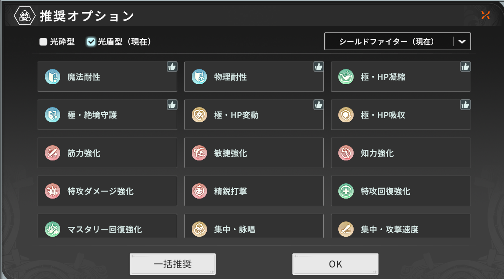
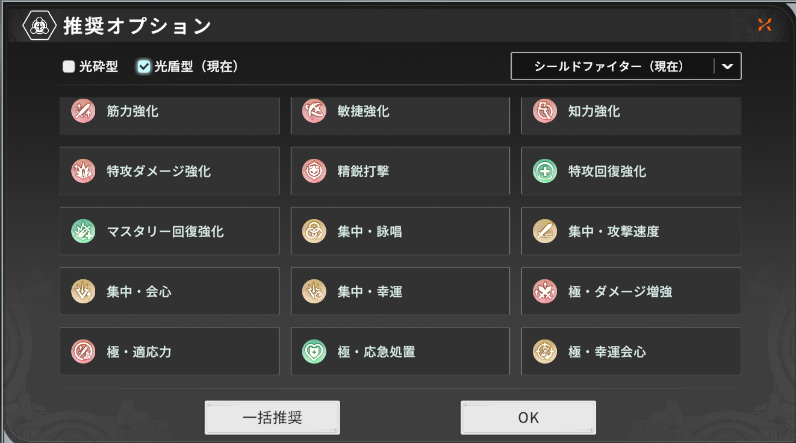
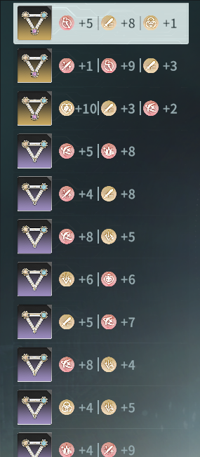
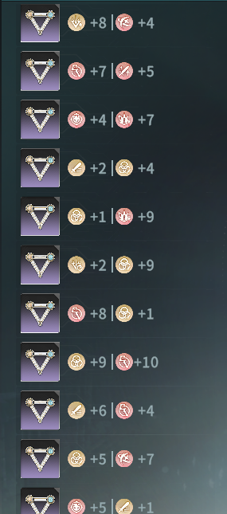
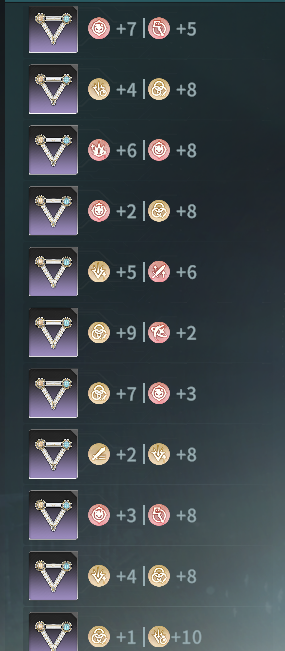
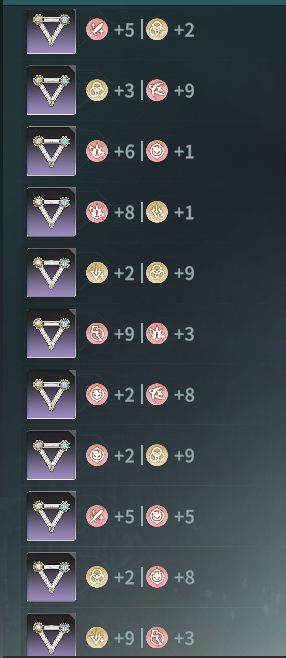
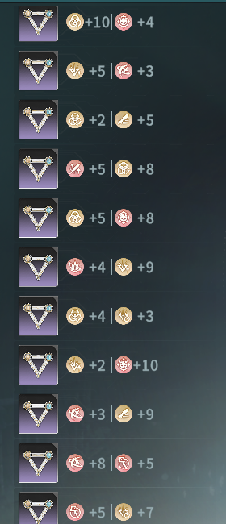
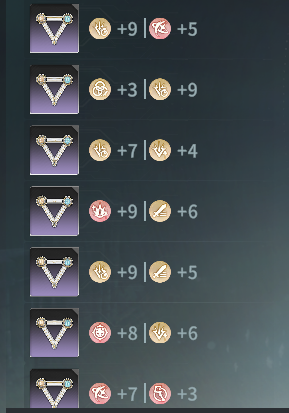
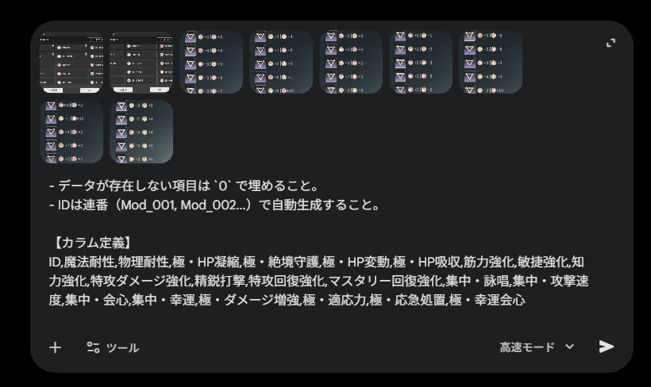

# CSVデータの作成と管理ガイド

本ツールで最も重要な「モジュールデータのCSV化」についての詳細ガイドです。
基本的には **AI（ChatGPT, Gemini等）による画像解析** を推奨しています。手入力は大変な労力を要するため、AIでベースを作成し、必要に応じて手動で修正するフローを基本としてください。

---

## 📸 1. 画像の準備（スクリーンショット）

AIの認識精度を高めるため、以下の点に注意してスクリーンショットを撮影してください。

### 推奨する撮影方法
- **「マスタ画像」を撮る**:
    - アイコンと「項目名（テキスト）」が一覧で表示されている画面（フィルタ画面やヘルプ画面など）を用意します。
    - **1枚に収まらない場合は、複数枚に分けて撮影してください。**
    - これをAIに見せることで、「このアイコンは『魔法耐性』である」という辞書学習をさせます。

    > **マスタ画像の例**  
    > 
    > <br>
    > 

- **「モジュール詳細画像」を撮る**:
    - モジュールのステータス詳細が表示されている画面を撮影します。
    - **1枚に複数個** のモジュールが映っていても構いません（PC版での一覧表示など）。
    - 数値とアイコンができるだけ鮮明に映る解像度で撮影してください。

    > **ターゲット画像の例 (モジュール詳細)**  
    > 
    > <br>
    > 
    > <br>
    > 
    > <br>
    > 
    > <br>
    > 
    > <br>
    > 
    > <br>
    > 

---

## 🤖 2. AIによるCSV生成手順

以下のステップでAIに指示を出します。

### Step 1: 画像のアップロード
使用するAI（ChatGPT / Gemini 1.5 Pro 推奨）のチャット画面を開き、**「マスタ画像」と「モジュール画像（全て）」を一度にまとめてアップロード** してください。

### Step 2: プロンプトの送信
以下のプロンプトをコピーして送信します。
※ モデルによっては「画像を解析できません」と返答される場合がありますが、Gemini 1.5 Pro や GPT-4o であれば高確率で成功します。

> **プロンプト入力のイメージ**  
> 

```text
あなたは高精度なゲームデータ解析AIです。添付した複数の画像を以下のルールで処理し、解析結果をCSV形式のみ出力してください。余計な解説は不要です。

【画像の種類と役割】
1. **マスタ画像**: 添付画像のうち、アイコンと「項目名（テキスト）」が一覧で書かれている画像があります。これを「辞書」として認識してください。
2. **ターゲット画像**: それ以外の画像は、読み取るべき「実際のモジュール」のスクリーンショットです。

【処理手順】
1. まず「マスタ画像」を見て、アイコンの形と項目名（「魔法耐性」「集中・攻撃速度」など）の対応関係を視覚的に学習してください。
2. 次に「ターゲット画像」を見て、各モジュールが持っているアイコンをマスタ画像と照合し、項目名を特定してください。
3. アイコンの横にある「数値」を読み取ってください。
4. 読み取った結果を、以下のCSVフォーマットに変換してください。

【CSV出力ルール】
- 以下の22カラムを必ず含めること（順序厳守）。
- データが存在しない項目は `0` で埋めること。
- IDは連番（Mod_001, Mod_002...）で自動生成すること。

【カラム定義】
ID,魔法耐性,物理耐性,極・HP凝縮,極・絶境守護,極・HP変動,極・HP吸収,筋力強化,敏捷強化,知力強化,特攻ダメージ強化,精鋭打撃,特攻回復強化,マスタリー回復強化,集中・詠唱,集中・攻撃速度,集中・会心,集中・幸運,極・ダメージ増強,極・適応力,極・応急処置,極・幸運会心
```

---

## � 3. データの管理と手動修正

AIが出力したCSVテキストをコピーし、お手元の `data.csv` （任意の名前でOK）に保存します。

### データの更新（週次等の定常作業）
無理に1つのCSVファイルで管理し続ける必要はありません。
例えば `2024-05-01_scan.csv` のように日付ごとのファイルを作成し、ツール側で読み込むファイルを切り替えるか、テキストエディタで古いファイルの中身に追記（コピペ）して統合するのが簡単です。

### 手動での修正・追加
特定の1個だけ数値が間違っていたり、新しく入手したモジュールを1個だけ追加したい場合は、Excelやテキストエディタで直接編集するのが早いです。

#### 必須ヘッダー（コピペ用）
新規にCSVファイルを作成する場合は、以下の1行目を必ず入れてください。

```text
ID,魔法耐性,物理耐性,極・HP凝縮,極・絶境守護,極・HP変動,極・HP吸収,筋力強化,敏捷強化,知力強化,特攻ダメージ強化,精鋭打撃,特攻回復強化,マスタリー回復強化,集中・詠唱,集中・攻撃速度,集中・会心,集中・幸運,極・ダメージ増強,極・適応力,極・応急処置,極・幸運会心
```

#### サンプルデータ
リポジトリに含まれる [sample.csv](sample.csv) がテンプレートとして利用できます。
各項目の入力形式の確認にご利用ください。
