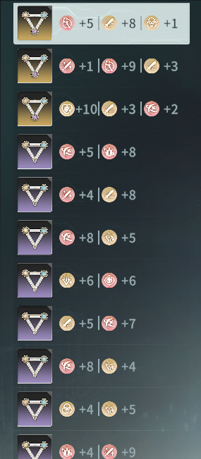
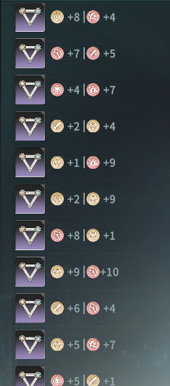

# CSVデータの作成と管理ガイド

本ツールで最も重要な「モジュールデータのCSV化」についての詳細ガイドです。
基本的には **AIによる画像解析** を推奨しています。手入力は大変な労力を要するため、AIでベースを作成し、必要に応じて手動で修正するフローを基本としてください。

---

## 📸 1. 画像の準備（スクリーンショット）

AIの認識精度を高めるため、以下の点に注意してスクリーンショットを撮影してください。

- **モジュール詳細画像を撮る**:
    - モジュールのステータス詳細が表示されている画面を撮影します。
    - **1枚に複数個** のモジュールが映っていても構いません（PC版での一覧表示など）。
    - 数値とアイコンができるだけ鮮明に映る解像度で撮影してください。

    > **ターゲット画像の例 (モジュール詳細)**  
    > 
    >  
    > 

---

## 🤖 2. CSVデータの自動生成

前バージョンではチャットプロンプトを用いて解析を依頼していましたが、モジュール項目の増加に伴い、その手法では手間とエラーがかかるようになりました。
そのため現在は、Antigravity等のエージェント環境を利用した専用の自動抽出ワークフロー（`tools/csv_processor`）へ移行しています。

この新しい自動化ワークフローの具体的な使い方（画像の指定方法やコマンド）については、以下の専用マニュアルを参照してください。

- 詳しくは [tools/csv_processor/README.md](tools/csv_processor/README.md) をご覧ください。

---

## 💬 3. チャットプロンプトを用いた代替手順

もし何らかの理由で専用環境が使用できず、従来のチャットインターフェースから手動で指示を出したい場合

- 詳しくは [tools/csv_processor/README.md](tools/csv_processor/README.md) の「B. 一般的なAIエージェントを使用する場合」セクションをご覧ください。

---

## 🛠 4. データの管理と手動修正

自動化ワークフロー・手動ワークフローを問わず、**AIによる画像解析とCSV抽出は100%完璧ではなく、誤認識や取りこぼしが発生する可能性があります。**
そのため、抽出されたデータは必ずご自身の目で確認し、必要に応じて手動で修正するプロセスを忘れないでください。

### 手動での修正・追加
特定の1個だけ数値が間違っていたり、新しく入手したモジュールを1個だけ追加したい場合は、Excelやテキストエディタでcsvを直接編集するのが早いです。
