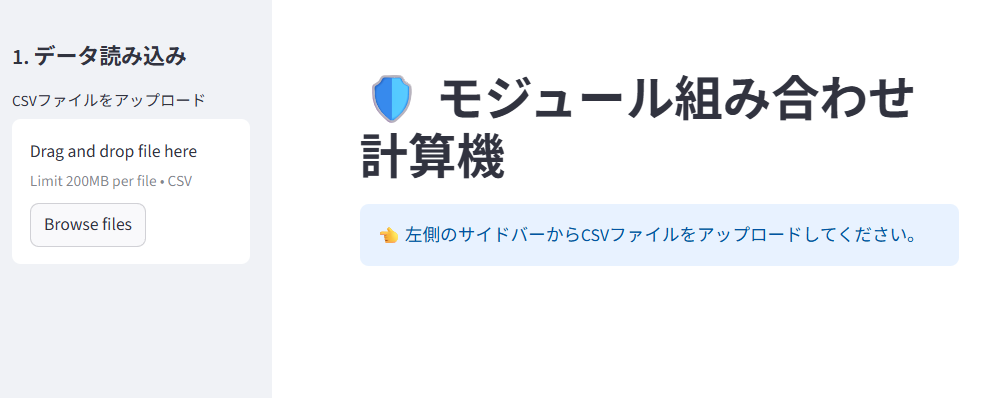
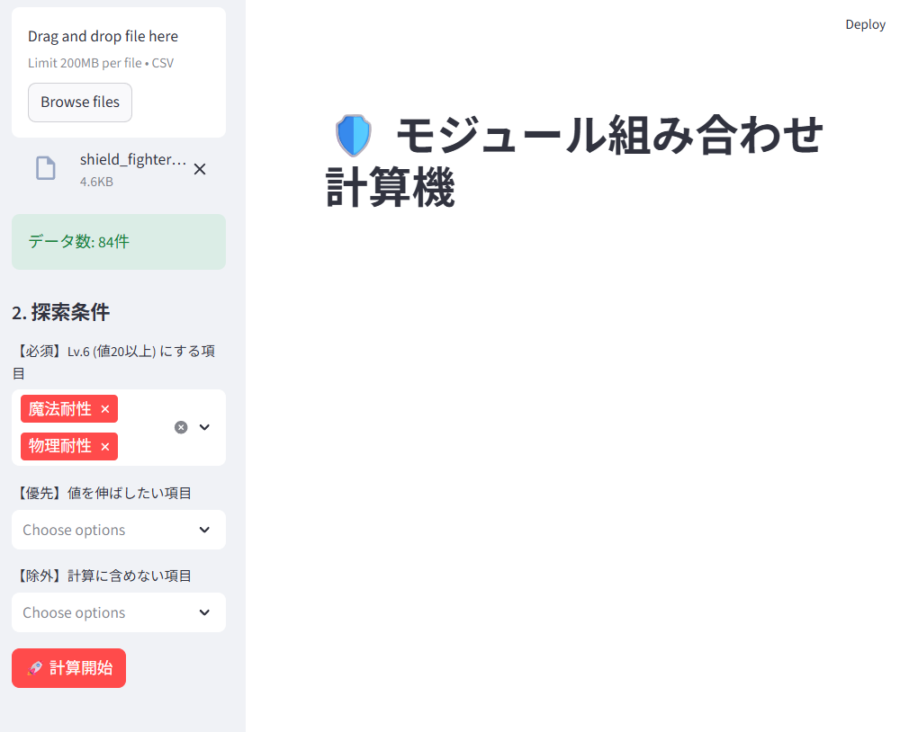
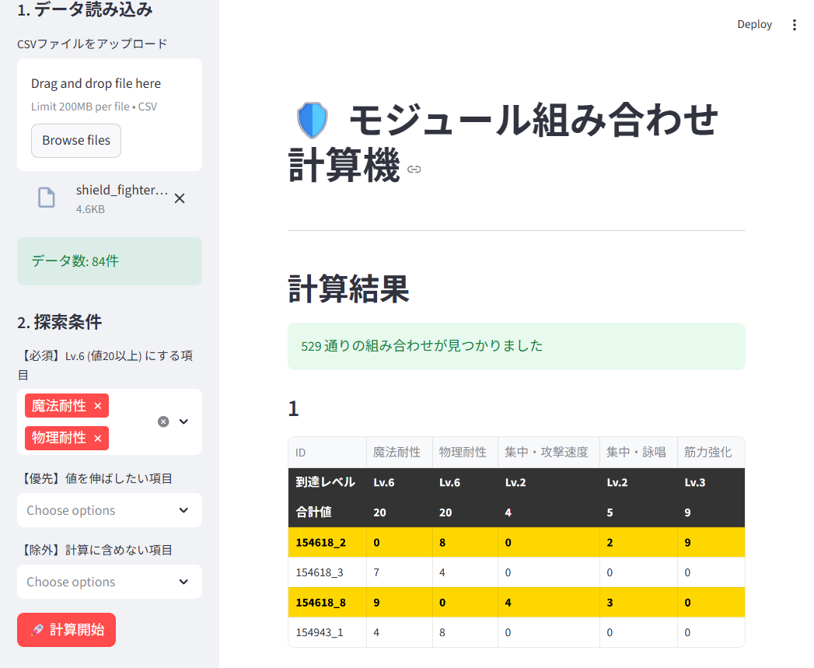

# Star Resonance Module Calculator

ゲーム「スターレゾナンス」のモジュール装備において、最適な組み合わせ（特に「魔法耐性」「物理耐性」などのLv.6到達）を探索するための計算ツールです。

Python + Streamlit で構築されており、Docker環境があればすぐに利用可能です。

## Features

- **CSV読み込み**: AIを使用し抽出したモジュールデータのCSV([CSVデータの作成と管理ガイド](CSV_CREATION.md))をドラッグ＆ドロップで読み込みます。
- **最適解の探索**: 指定したステータス（例：魔法耐性、物理耐性）がLv.6（値20以上）になる4つのモジュールの組み合わせを全探索します。
- **柔軟な条件設定**: 必須項目、優先項目、除外項目を設定して検索可能です。
- **シンプルUI**: 計算結果はランク順に表示され、各項目の到達レベルと合計値を一目で確認できます。

## Requirement

- Docker
- Docker Compose

## Installation & Usage

### 1. Clone or Download
このリポジトリをクローンするか、ZIPでダウンロードして解凍します。

### 2. Start Application
プロジェクトのルートディレクトリで以下のコマンドを実行し、コンテナを起動します。

```bash
docker compose up -d
```

### 3. Access
ブラウザで以下のURLにアクセスしてください。

http://localhost:8501

> **初期画面**  
> アプリケーションにアクセスすると、左側にサイドバー、右側にメインエリアが表示されます。  
> 

### 4. Upload & Settings
サイドバーからCSVファイルをアップロードし、探索条件を設定します。

> **設定画面**  
> マスタ画像とモジュール画像を解析して作成したCSVファイルをアップロードし、Lv.6を目指す項目（必須）や優先項目を選択します。  
> 

### 5. Calculation Result
「計算開始」ボタンを押すと、条件を満たす組み合わせが計算され、結果一覧が表示されます。

> **計算結果画面**  
> 組み合わせ候補がランク順に表示されます。到達レベルや合計値を確認できます。  
> 

### 6. Stop Application
使用を終了する場合は以下のコマンドを実行します。

```bash
docker compose down
```

## CSV Format

本ツールで読み込むCSVファイルには、以下のカラムが必要です。
値が存在しない項目には `0` を入力してください。

> **Note**
> 画像からAIを使って自動でCSVを作成するプロンプトや、手動での管理・修正方法は、 CSVデータの作成と管理ガイド **[CSVデータの作成と管理ガイド](CSV_CREATION.md)** を参照してください。

### 必須カラム一覧
以下の22項目がヘッダーに含まれている必要があります。

```text
ID
魔法耐性
物理耐性
極・HP凝縮
極・絶境守護
極・HP変動
極・HP吸収
筋力強化
敏捷強化
知力強化
特攻ダメージ強化
精鋭打撃
特攻回復強化
マスタリー回復強化
集中・詠唱
集中・攻撃速度
集中・会心
集中・幸運
極・ダメージ増強
極・適応力
極・応急処置
極・幸運会心
```

## License

[MIT License](LICENSE)
